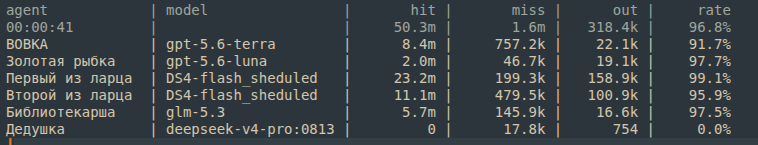

# Manglobite

## Инструменты для OpenCode

| Репозиторий | Описание |
|---|---|
| [opencode-safe-curl](https://github.com/Manglobite/opencode-safe-curl) | HTTP-запросы без shell-выполнения. Блокирует приватные IP и metadata-эндпоинты, защита от SSRF |
| [opencode-git-readonly](https://github.com/Manglobite/opencode-git-readonly) | Read-only инспекция Git-worktree по фиксированному allowlist операций. Для агентов вне репозитория |
| [opencode-gitlab-readonly](https://github.com/Manglobite/opencode-gitlab-readonly) | Read-only доступ к GitLab REST API: MR, пайплайны, диффы, комментарии |
| [opencode-postgresql-readonly](https://github.com/Manglobite/opencode-postgresql-readonly) | Выполнение только SELECT-запросов к Postgres |
| [opencode-confluence-fetch](https://github.com/Manglobite/opencode-confluence-fetch) | Получение страниц Confluence по page_id через REST API |
| [opencode-speca-fetch](https://github.com/Manglobite/opencode-speca-fetch) | Загрузка OpenAPI-спецификаций из speca.io |
| [opencode-agent-browser-tool](https://github.com/Manglobite/opencode-agent-browser-tool) | Браузерная автоматизация для агентов: navigate, snapshot, click, type, eval и др. Docker + Chrome, PAC-прокси |

## Плагины

| Репозиторий | Описание |
|---|---|
| [opencode-token-bar-plugin](https://github.com/Manglobite/opencode-token-bar-plugin) | Панель статистики токенов над промптом OpenCode: агрегация по дереву сессий, hit-rate кэша, активное время |
| | <p align="center"></p> |

## Установка

Каждый репозиторий самостоятелен, инструкция — в его README:

```bash
git clone https://github.com/Manglobite/<имя-репозитория>.git
```

---

## Исследования инференса

| Репозиторий | Описание |
|---|---|
| [2xcmp50+1xrtx2080(22gb) qwen36-35b-a3b-mtp-q4_k_p](https://github.com/Manglobite/inference-cmp50-rtx2080-qwen36-35b-a3b-mtp-q4_k_p) | Инференс qwen36-35b-a3b-mtp-q4_k_p на двух CMP50HX по 10Gb + RTX2080TI 22gb. Карты подключены через самые простые райзеры pci-e 1x |
| [cmp50HX "tuning"](https://github.com/Manglobite/inference-cmp50-tuning) | Исследование производительности инференса на видеокартах CMP50HX |
| [Скорость инференса MiMo-V2.6-Distill-Qwen-9B](https://github.com/Manglobite/inferece-bench-MiMo-V2.6-Distill-Qwen-9B) | Тесты производительности инференса MiMo-V2.6-Distill-Qwen-9B на CMP50HX и RTX2080ti 22gb |


<p align="center">🤖⚙️ <b>Сделано с агентами для агентов и людей</b> 🤖⚙️</p>
